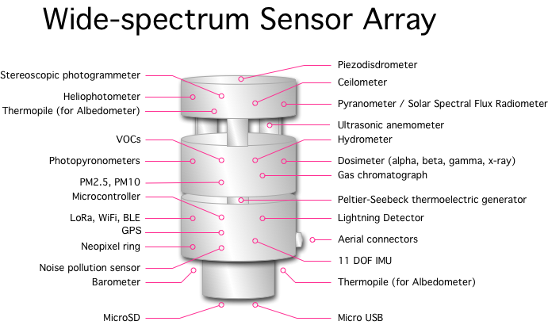

## Project Goals

Develop a low cost (less than $500) wide-spectrum environment sensor with the following capabilities:

* **Light** - how sunny is it?
    * IR, visible, UV?
    * intensity?
    * how much is reflected from the ground?
* **Clouds** - is it cloudy?
    * what sort of clouds?
    * cloud base height?
    * velocity of clouds?
    * affect on solar and wind power?
* **Wind** - in immediate vicinity of sensor
    * direction and speed?
    * wind chill factor?
* **Gas** - what gasses are in the air?
    * determine the type and volume of each gas, both in immediate vicinity and also in upper atmosphere
* **Moisture** - how much moisture in the air?
    * immediate vicinity and also upper atmosphere
    * is it foggy/misty?
    * what is the dew point?
* **Precipitation** - rain, sleet, snow, hail
    * classify hydrometeor type, size, velocity and distribution
* **Lightning** - is there an electric storm?
    * storm size and severity
    * storm direction and distance
    * ideally determine if it's IC or CC
* **Fire** - are there any fires in visual range of sensor?
    * optical sensor to detect flames for early visual warning
    * gas and/or particulate sensor would detect smoke
* **Particulate** - what size of particles are floating in the air?
    * PM2.5, PM10
    * ideally classify common particulate (eg. pollen)
* **Temperature** - how hot or cold is it?
    * how much heat from the sun?
    * how much heat from the ground?
* **Pressure** - what is the air pressure?
    * determine height above sea level
* **Earthquakes** - is the ground shaking?
    * 3-axis seizmometer
* **Sound** - how noisy is it?
    * which direction?
    * which frequency bands?
    * how much subsonic and ultrasonic noise is there?
* **Location** - where is the sensor?
    * geo co-ordinates?
    * altitude?
    * orientation?
* to be continued
